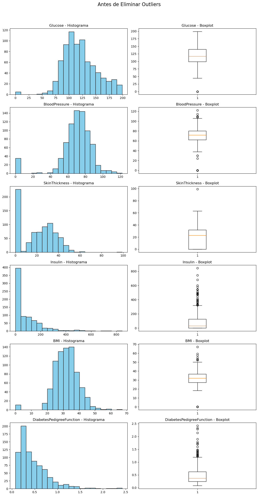
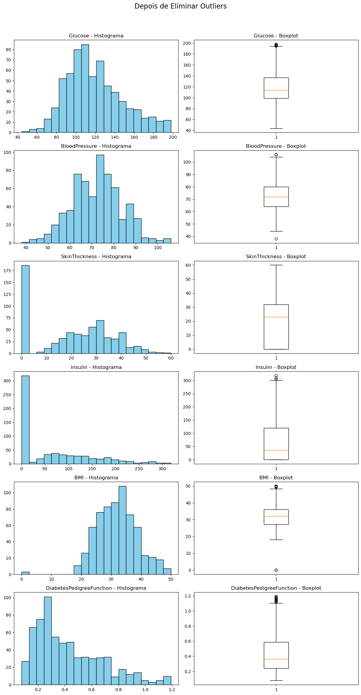
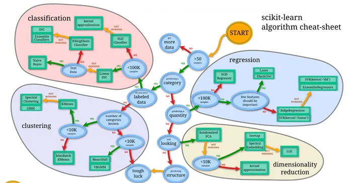
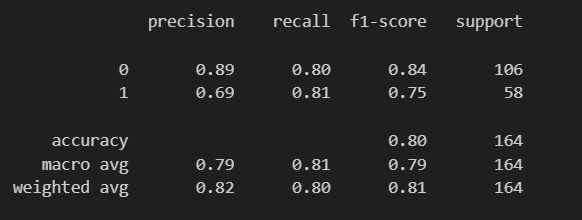
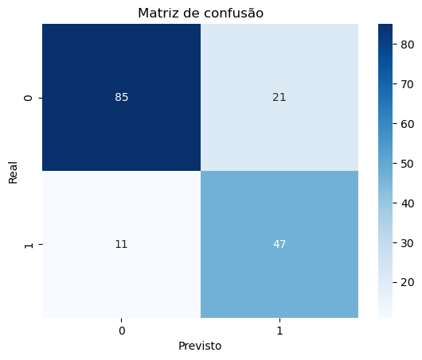
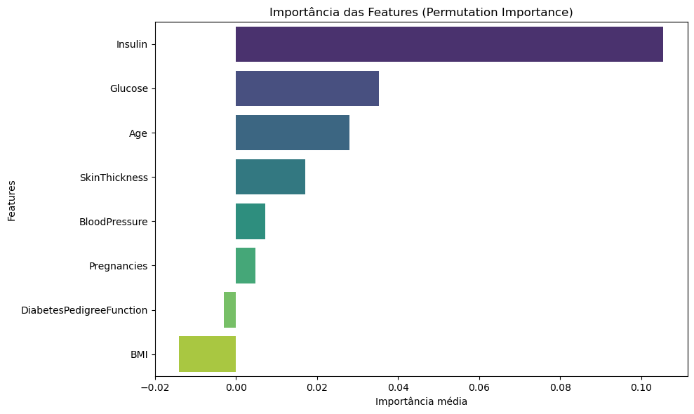

# 🩺 Previsão de Diabetes com Machine Learning

Projeto de **Machine Learning** cujo objetivo é prever se um paciente tem **diabetes** com base em variáveis médicas e fisiológicas.

O modelo utiliza técnicas de **limpeza de dados, tratamento de outliers, balanceamento de classes, pipelines de Machine Learning e otimização de hiperparâmetros**.

---

# 📊 Dataset

O dataset contém informações médicas de pacientes utilizadas para prever a presença de diabetes.

Variável alvo:

```text
Outcome
```

* **0** → Não diabético
* **1** → Diabético

### Features utilizadas

| Feature                  | Descrição                      |
| ------------------------ | ------------------------------ |
| Pregnancies              | Número de gravidezes           |
| Glucose                  | Nível de glicose               |
| BloodPressure            | Pressão arterial               |
| SkinThickness            | Espessura da pele              |
| Insulin                  | Nível de insulina              |
| BMI                      | Índice de massa corporal       |
| DiabetesPedigreeFunction | Histórico familiar de diabetes |
| Age                      | Idade                          |

---

# 📊 Análise Exploratória dos Dados

Inicialmente foram analisadas as distribuições das variáveis utilizando **histogramas e boxplots** para identificar padrões e possíveis outliers.



---

# 🧹 Tratamento de Outliers

Foi aplicado o método **IQR (Interquartile Range)** para identificar valores extremos nas variáveis:

* Glucose
* BloodPressure
* SkinThickness
* Insulin
* BMI
* DiabetesPedigreeFunction

Após remover os outliers, as distribuições ficaram mais equilibradas.



---

# 🔧 Tratamento de Valores Impossíveis

Algumas variáveis apresentavam **valores iguais a zero**, o que não é biologicamente plausível, como por exemplo:

* SkinThickness
* Insulin

Esses valores foram substituídos por **NaN** e posteriormente preenchidos utilizando a **mediana por grupo da variável alvo (`Outcome`)**.

Esta estratégia mantém diferenças estatísticas entre pacientes diabéticos e não diabéticos.

---

# ⚙️ Pipeline de Machine Learning

Foi construída uma **Pipeline completa** que inclui:

* **StandardScaler** → normalização das variáveis
* **SMOTE** → balanceamento do dataset
* **Classificador**

O **SMOTE** foi utilizado porque o dataset apresenta **desbalanceamento entre as classes**.

Pipeline:

```text
StandardScaler
→ SMOTE
→ Classifier
```

---

# 🤖 Modelos Testados

Foram avaliados diferentes algoritmos de classificação utilizando **GridSearchCV**:

* LinearSVC
* LogisticRegression
* KNeighborsClassifier

Imagem comparativa dos modelos testados:



---

# 📈 Resultados

Após otimização dos hiperparâmetros, o modelo atingiu:

**Acurácia no conjunto de teste**

```text
0.80
```

Relatório de classificação:



### Interpretação

* O modelo acerta cerca de **84% das previsões**.
* Consegue identificar **83% dos pacientes diabéticos (recall)**.
* A precisão para casos positivos ainda pode ser melhorada.

---

# 🔍 Matriz de Confusão

A matriz de confusão mostra a distribuição das previsões corretas e incorretas.



Ela permite observar:

* Verdadeiros positivos
* Verdadeiros negativos
* Falsos positivos
* Falsos negativos

---

# 📊 Importância das Features

Foi utilizada **Permutation Importance** para identificar as variáveis mais relevantes para a previsão.



Este método mede o impacto de cada variável na performance do modelo.

---

# 💾 Guardar o Modelo

O modelo final foi guardado para utilização futura com **joblib**.

```python
import joblib
joblib.dump(modelo_otimo, "models/modelo_diabetes.pkl")
```

---

# 🚀 Aplicação Interativa (Streamlit)

Foi desenvolvida uma aplicação interativa utilizando **Streamlit**, onde o utilizador pode inserir os dados médicos de um paciente e obter uma previsão sobre a probabilidade de diabetes.

A aplicação permite:

* Inserir características médicas do paciente
* Obter a previsão do modelo
* Visualizar o resultado de forma imediata

---

# 📦 Bibliotecas Utilizadas

As dependências do projeto encontram-se no ficheiro **requirements.txt**.

Principais bibliotecas:

* pandas
* numpy
* seaborn
* matplotlib
* scikit-learn
* imbalanced-learn
* streamlit
* joblib

---

# 📁 Estrutura do Projeto

```
Previsao_Diabetes_StreamLit
│
├── data
│   └── diabetes.csv
│
├── Images
│   ├── com_outliers.png
│   ├── sem_outliers.png
│   ├── model.png
│   ├── classification_report.png
│   ├── matriz_confusao.png
│   └── importancia_features.png
│
├── models
│   └── modelo_diabetes.pkl
│
├── diabetes.ipynb
│
├── requirements.txt
│
└── README.md
```

---

# ▶️ Como Executar o Projeto

1. Clonar o repositório

```
git clone https://github.com/FranciscoG08/Previsao_Diabetes_StreamLit.git
```

2. Entrar na pasta do projeto

```
cd Previsao_Diabetes_StreamLit
```

3. Criar ambiente virtual

```
python -m venv env
```

4. Ativar ambiente virtual

Windows:

```
env\Scripts\activate
```

5. Instalar dependências

```
pip install -r requirements.txt
```

6. Executar aplicação Streamlit

```
streamlit run streamlit_modelo_diabetes.py
```

---

# 👨‍💻 Autor

Francisco Guedes
